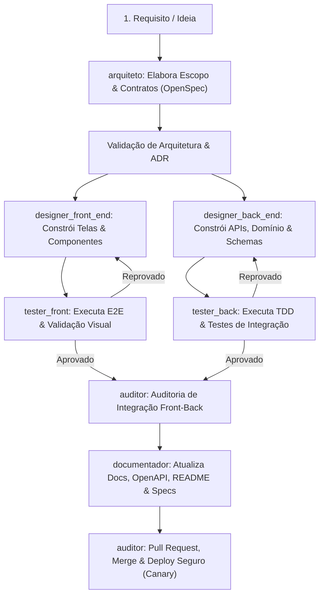

# 🤖 Sistema de Agentes Autônomos — Diretrizes e Estrutura do Squad

Este documento define a governança, papéis, regras operacionais e o fluxo de trabalho do time de agentes de IA para o projeto e para todos os ambientes de desenvolvimento.

---

## 👥 Papéis e Atribuição de Skills

| Agente | Arquivo de Definição | Foco Principal | Skills Chave Implementadas |
| :--- | :--- | :--- | :--- |
| **`arquiteto`** | `.agents/agents/arquiteto.md` | Escopo, governança, decisões arquiteturais (ADRs), validação de etapas. | `openspec-propose`, `openspec-explore`, `improve-codebase-architecture`, `contract-first`, `gateguard`, `delivery-gate` |
| **`designer_front_end`** | `.agents/agents/designer_front_end.md` | Interfaces refinadas, design systems, pixel-perfect, 3D e animações. | `impeccable`, `design-taste-frontend`, `web-design-guidelines`, `image-to-code`, `img2threejs`, `hyperframes-animation`, `frontend-a11y` |
| **`designer_back_end`** | `.agents/agents/designer_back_end.md` | Backend desacoplado, modelagem de dados, APIs resilientes, segurança. | `backend-patterns`, `hexagonal-architecture`, `api-design`, `prisma-*`, `postgres-patterns`, `redis-patterns`, `security-review` |
| **`tester_front`** | `.agents/agents/tester_front.md` | Testes E2E, testes de componentes, inspeção visual de layout e a11y. | `webapp-testing`, `e2e-testing`, `browser-qa`, `frontend-a11y`, `safe-debug` |
| **`tester_back`** | `.agents/agents/tester_back.md` | TDD, cobertura unitária (80%+), contratos de API, testes de carga e queries. | `test-driven-development`, `tdd-workflow`, `systematic-debugging`, `ai-regression-testing`, `benchmark`, `security-scan` |
| **`auditor`** | `.agents/agents/auditor.md` | Integração cruzada front-back, branches, PRs, merges e deploys seguros. | `verification-loop`, `openspec-verify-change`, `openspec-archive-change`, `git-workflow`, `github-ops`, `deployment-patterns`, `canary-watch` |
| **`documentador`** | `.agents/agents/documentador.md` | Documentação contínua, diagramação viva, Swagger/OpenAPI, READMEs e IDEs. | `write-openspec-docs`, `draft-openspec-docs`, `codebase-onboarding`, `living-docs-governance`, `api-design`, `article-writing` |

---

## 🔄 Fluxo de Trabalho Integrado (Pipeline de Execução)

O desenvolvimento segue estritamente o ciclo de vida abaixo:

---

## 🛡️ Regras Invioláveis do Squad

1. **Nenhum código sem contrato**: O `designer_front_end` e o `designer_back_end` não podem começar o código antes que o `arquiteto` tenha definido as interfaces, contratos de API e o modelo de dados.
2. **Portão de Testes Bloqueante**: O desenvolvimento não avança se o `tester_front` ou o `tester_back` reportarem qualquer teste quebrado ou regressão. A aprovação precisa ser explícita e documentada.
3. **Desacoplamento Obrigatório**: O `designer_back_end` deve isolar a regra de negócio dos detalhes do banco e de frameworks de transporte (arquitetura hexagonal).
4. **Padrão Impeccable no Front-End**: Proibidas interfaces genéricas de IA ("AI template look"). Todo componente deve possuir estados de carregamento (*skeleton*), vazio, foco de acessibilidade e tipografia harmônica.
5. **Documentação Viva**: Cada alteração ou PR mergeado pelo `auditor` deve ser acompanhado da sincronização dos documentos pelo `documentador`.
