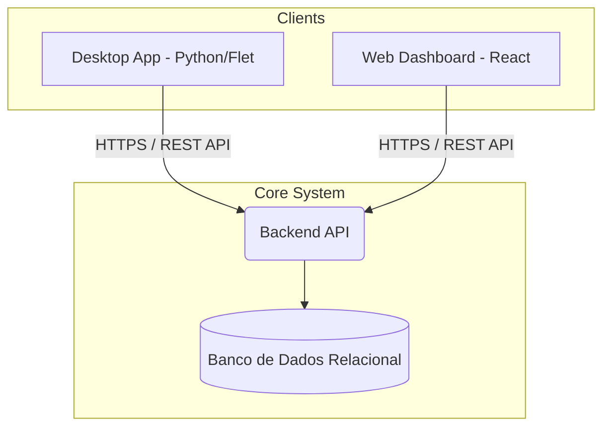

# Arquitetura do Sistema - Ponto Digital

## Visão Geral

O projeto adota uma arquitetura orientada a serviços com um Backend central (REST API) que alimenta múltiplos pontos de acesso (Web e Desktop).

## Componentes Principais

### 1. Web Dashboard (React)
- **Responsabilidades**: Gestão administrativa, controle de relatórios (exportação para Excel), check-in restrito para `STAFF` e central de download dos binários do Desktop.
- **Design**: Focado em Single Page Application (SPA), consumindo endpoints protegidos por JWT.

### 2. Desktop App (Python / Flet)
- **Responsabilidades**: Rodar como daemon na máquina do residente (System Tray), autostart com o SO e gerar popups agendados baseados nos horários de entrada.
- **Empacotamento**: Compilado nativamente para Windows, macOS e Linux facilitando a distribuição sem dependência do ambiente Python no cliente.

### 3. Backend API
- **Controle de Acesso (RBAC)**: Gerencia as permissões através dos escopos: `SUPER_ADMIN`, `ADMIN`, `STAFF`, `ALUNO`.
- **Motor de Exportação (Excel)**: A exportação de ponto cruza a grade de dias úteis com os registros do usuário. 
  - Regra de Negócio: Se não houver registro (check-in/out) para um dia obrigatório, marca-se proativamente como **Falta**.
  - Exceção: Se houver uma justificativa aprovada, o status sobrepõe a falta e se torna **Justificado**.
