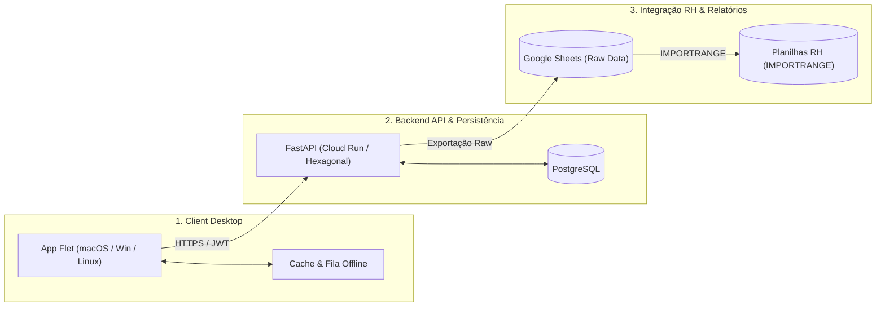

# 🕐 Ponto Digital — Sistema de Ponto Multiplataforma

Sistema moderno e automatizado de registro e gestão de ponto eletrônico para ambientes de trabalho e acadêmicos, com suporte nativo multiplataforma (macOS, Windows e Linux), API centralizada resiliente, sincronização com Google Sheets para auditoria e dashboard web administrativo.

---

## 🛠️ Stack Tecnológica

O projeto é estruturado em um monorepo com as seguintes tecnologias principais:

- **Backend API**: Python 3.11+ com [FastAPI](https://fastapi.tiangolo.com/), [SQLAlchemy 2.0](https://www.sqlalchemy.org/) (Async), [Alembic](https://alembic.sqlalchemy.org/), [Pydantic V2](https://docs.pydantic.dev/) e Arquitetura Hexagonal.
- **Client Desktop**: Python 3.11+ com [Flet](https://flet.dev/) (Flutter engine) empacotado nativamente via [PyInstaller](https://pyinstaller.org/).
- **Dashboard Web**: [React 19](https://react.dev/), [Vite](https://vitejs.dev/), [TailwindCSS](https://tailwindcss.com/) e TypeScript.
- **Banco de Dados**: [PostgreSQL](https://www.postgresql.org/) para persistência relacional com suporte a concorrência e transações ACID.
- **Camada de Dados & Integração**: [Google Sheets API](https://developers.google.com/sheets/api) via Service Account dedicada para alimentação contínua de dados brutos (*raw data*) e consumo via `IMPORTRANGE`.
- **Infraestrutura & DevOps**: Docker, Google Cloud Run, Google Cloud Build e GitHub Actions para CI/CD automatizado.

---

## 🏛️ Arquitetura do Sistema

O sistema opera em um modelo distribuído e desacoplado composto por **3 camadas principais**:



1. **Client Desktop (Apresentação & Coleta)**: Aplicativo leve executado nas estações de trabalho, permitindo check-in/check-out rápido, autenticação e tolerância a interrupções temporárias de rede.
2. **Backend API (Processamento & Regras de Negócio)**: Núcleo desacoplado (Domain, Application e Adapters) responsável pelo cômputo de jornadas, banco de horas, validações de integridade e auditoria.
3. **Google Sheets (Camada de Dados Raw)**: Repositório isolado de auditoria e consumo corporativo, permitindo que a equipe de gestão e RH continue utilizando suas fórmulas e fluxos sem acoplamento direto com a base SQL.

---

## 📂 Componentes do Monorepo

Navegue pela documentação específica de cada módulo:

- 🖥️ [**Client Desktop**](./client/README.md): Instruções de execução local, empacotamento com Flet/PyInstaller e scripts de instalação para macOS, Windows e Linux.
- ⚙️ [**Backend API**](./backend/README.md): Configuração do ambiente Python, migrações com Alembic, rotas da API e suíte de testes.
- 📊 [**Dashboard Web**](./dashboard/README.md): Painel administrativo em React 19 + Vite para acompanhamento de pontos em tempo real e parametrizações.
- 📚 [**Documentação & ADRs**](./docs/README.md): Arquitetura detalhada, especificações de contratos e decisões arquiteturais registradas (ADRs).

---

## 🚀 Instalação

### Pré-requisitos
- **Python 3.11+** instalado.
- **Node.js 20+** e **npm** instalados.
- **Docker** e **Docker Compose** (recomendado para banco de dados local).
- **PostgreSQL 15+** (se executado fora do Docker).

### Clonando o Repositório
```bash
git clone https://github.com/andreatlas/Ponto_Residencia.git
cd Ponto_Residencia
```

---

## 💻 Desenvolvimento

### 1. Inicializando o Backend
```bash
cd backend
python3.11 -m venv .venv
source .venv/bin/activate  # No Windows: .venv\Scripts\activate
pip install -r requirements.txt
alembic upgrade head
uvicorn app.api.main:app --reload --port 8000
```

### 2. Inicializando o Client Desktop
```bash
cd client
python3.11 -m venv .venv
source .venv/bin/activate  # No Windows: .venv\Scripts\activate
pip install -r requirements.txt
python -m src.ui.main
```

### 3. Inicializando o Dashboard Web
```bash
cd dashboard
npm install
npm run dev
```

---

## 🚢 Deploy

- **Backend API**: Automatizado via [Cloud Build](./infra/cloudbuild.yaml) para implantação contínua no **Google Cloud Run** com Cloud SQL.
- **Client Desktop**: Empacotamento multiplataforma automatizado via [GitHub Actions](./.github/workflows/release-client.yml) disparado pela publicação de tags de versão (`v*`).
- **Dashboard Web**: Build estático otimizado gerado via `npm run build`, distribuível em serviços como Cloud Storage + Cloud CDN, Vercel ou Cloud Run.

---

## 📄 Licença

Este projeto é distribuído sob os termos da licença proprietária/interna para uso e gestão de ponto na Residência de Software. Consulte o arquivo [LICENSE](./LICENSE) para mais detalhes.
