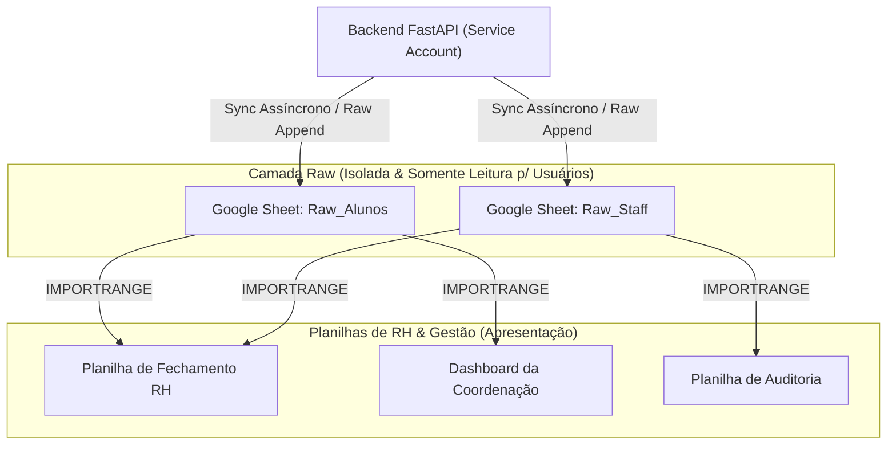

# ADR-003: Google Sheets como Camada de Dados Raw

- **Status**: Aceita
- **Data**: 2026-09-24
- **Decisores**: Squad de Arquitetura, Engenharia de Backend e Coordenação de RH/Gestão
- **Contexto Técnico**: Integrações & Camada de Dados / Ponto Digital

---

## Contexto

As equipes de Recursos Humanos, Operações e Gestão Acadêmica da Residência já possuem fluxos de trabalho e modelos consolidados em planilhas do **Google Sheets**. Esses fluxos incluem:
- Consolidação de horas para bolsas e folhas de pagamento;
- Dashboards com gráficos dinâmicos e tabelas dinâmicas pré-configuradas;
- Automações via Google Apps Script e fórmulas complexas conectadas entre diferentes departamentos.

Uma tentativa de substituir de forma abrupta o ecossistema do Google Sheets por um painel 100% fechado causaria atrito operacional, resistência de adoção e riscos de descontinuidade em processos de fechamento mensal. Por outro lado, permitir que o backend escrevesse diretamente nas planilhas formatadas de RH gerava sérios problemas:
- Colunas calculadas ou formatações manuais do RH eram sobrescritas por atualizações automáticas;
- Falhas de concorrência ou alterações acidentais de layout pelo usuário final quebravam os scripts de escrita do backend;
- Riscos de exposição indevida de dados sensíveis entre grupos de alunos e colaboradores corporativos.

---

## Decisão

Adotamos o **Google Sheets estritamente como uma Camada de Dados Brutos (*Raw Data Layer*)**, isolada e desacoplada das planilhas de trabalho dos usuários.

1. **Planilhas Raw Dedicadas**:
   - O backend, por meio de uma credencial corporativa (*Google Cloud Service Account*), mantém e sincroniza planilhas independentes dedicadas exclusivamente ao despejo de registros brutos:
     - `Ponto_Raw_Alunos` (registros de bolsistas e residentes acadêmicos)
     - `Ponto_Raw_Staff` (registros do time de gestão e funcionários)
2. **Padrão de Escrita Append-Only / Upsert Determinístico**:
   - Os dados são gravados com esquemas tabulares fixos (Data, ID Colaborador, Nome, Categoria, Entrada, Intervalo Saída, Intervalo Retorno, Saída, Total Horas, Hash de Auditoria).
   - Nenhuma formatação visual manual ou fórmula é aplicada nestas planilhas de destino.
3. **Consumo via `IMPORTRANGE`**:
   - As planilhas oficiais de RH, relatórios de gestão e dashboards de diretores leem os dados das planilhas raw utilizando a função nativa `=IMPORTRANGE(url_raw, range)`.
   - Dessa forma, qualquer edição, filtro ou formatação feita pelo RH ocorre na planilha final de apresentação, mantendo a camada raw intacta.

---

## Consequências

### Positivas
- **Isolamento e Segurança de Dados**: Alunos e gestores não têm acesso de escrita na planilha intermediária; o RH nunca mexe diretamente na base de exportação.
- **Proteção contra Sobrescita de Layout**: O RH tem liberdade total para alterar cores, filtros, criar novas abas e usar Apps Scripts em suas próprias planilhas sem risco de quebrar o coletor do backend.
- **Continuidade Operacional Imediata**: Zero fricção para os gestores, que continuam utilizando o Google Sheets com o qual já estão habituados, agora alimentado automaticamente em tempo quase real.
- **Separação de Privilégios**: As planilhas de alunos e staff possuem permissões de visualização segregadas na organização do Google Workspace.

### Negativas / Trade-offs
- **Limites de Quota da Google Sheets API**: Requisições de escrita em lote (*batchUpdate* / *append*) devem ser controladas para respeitar o limite padrão da Google API (300 requisições por minuto por projeto).
- **Dependência de Rede e Latência do IMPORTRANGE**: O Google Sheets pode levar alguns segundos ou poucos minutos para propagar mudanças de `IMPORTRANGE` em planilhas com grande volume de linhas.
