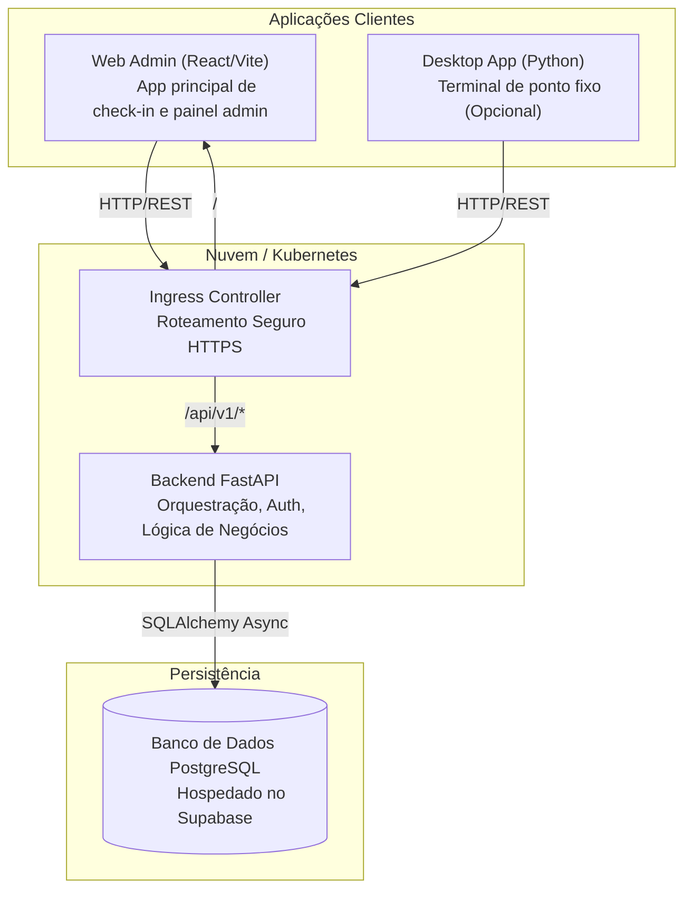

# Arquitetura do Ponto Digital - LabLivre

O Sistema de Ponto Digital do LabLivre foi desenvolvido para ser moderno, multiplataforma, escalável e de fácil manutenção. Ele utiliza uma arquitetura baseada em microsserviços e contêineres.

## Diagrama Geral

## Componentes

### 1. Frontend (`web_admin`)
Responsável pela interface do usuário (UI). Foi construído com foco em leveza e responsividade.
- **Framework:** React com TypeScript, empacotado via Vite.
- **Estilização:** Tailwind CSS (tema Light/Dark automático).
- **Ícones:** Lucide React.
- **Roteamento e Funcionalidades:**
  - `/ponto`: Tela interativa e segura onde alunos e staff batem o ponto, visualizam saldo de horas e editam seus perfis (nome e senha).
  - `/dashboard`: Painel Administrativo. Permite aos admins verificar quem está no lab, exportar relatórios avançados (CSV/Excel), autorizar check-ins em lote e editar cargos/turmas dos usuários.
- **Autenticação:** Baseada em JWT (Bearer Token) armazenado no LocalStorage. Nenhuma sessão de cookies é utilizada (stateless).

### 2. Backend (`backend`)
O coração do sistema, lida com toda a validação de regras, processamento de horas e exportação de dados.
- **Framework:** Python com FastAPI.
- **ORM:** SQLAlchemy (Operações 100% assíncronas com banco de dados para evitar bloqueios).
- **Banco de Dados:** PostgreSQL hospedado remotamente (Supabase/Neon/RDS), utilizando asyncpg.
- **Segurança:** Senhas com hash Bcrypt e rotas estritamente tipadas com validação pelo Pydantic.
- **Desempenho (Produção):** Executado através do Gunicorn com Uvicorn Workers (`uvicorn.workers.UvicornWorker`), garantindo o tratamento seguro de centenas de conexões simultâneas sem perdas.

### 3. Desktop App (`desktop_app`)
- Um cliente desktop legado ou complementar construído em Python, usado para pontos fixos no laboratório físico onde não há a necessidade de abrir navegadores. Possui mecanismo de auto-atualização e operação standalone.

### 4. Orquestração e Deploy (`k8s` e `docker-compose.yml`)
- O projeto foi otimizado para rodar de forma Cloud Native. 
- **Local/Desenvolvimento:** `docker-compose.yml` providencia um ambiente perfeitamente equalizado ao de produção com apenas 1 comando.
- **Produção (Kubernetes):** A pasta `k8s/` provê os manifestos para Deployments isolados, Services, ConfigMaps e rotas Ingress, configurando o ecossistema com usuários "não-root" visando a adequação às normativas de cibersegurança universitárias e corporativas.

## Decisões Arquiteturais

* **Stateful vs Stateless:** O K8s hospeda apenas a camada de computação (Stateless - FastAPI e React). A camada de estado (Stateful - Banco de Dados) está terceirizada em serviço gerenciado na nuvem (Supabase). Isso garante que os pods do Kubernetes possam ser destruídos, escalados e recriados instantaneamente sem nenhuma dor de cabeça com discos corrompidos ou perda de registros de horas dos alunos.
* **APIs Desacopladas:** O Frontend e o Backend são aplicações diferentes, subidas em contêineres isolados, unidos apenas pelo Ingress. Isso permite que a Vercel e o Render possam ser usados para hospedagem se o Laboratório não desejar manter seu próprio cluster Kubernetes.
